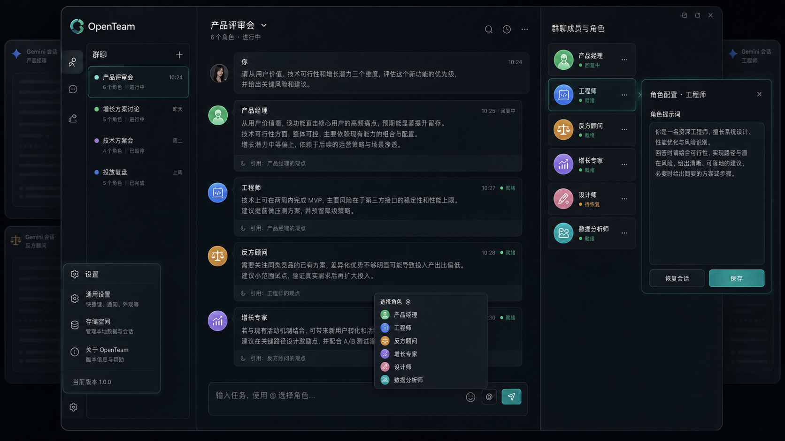

# Web Agent

**🌐 Language:** English | [简体中文](README.zh-CN.md)

> A local-first AI team workspace: a Chrome extension that turns your existing DeepSeek / Doubao web sessions into a multi-agent discussion room, plus a local agent-control CLI, an OpenAI-compatible model gateway, and an opencode integration.



## 🌱 Background

Web Agent is a **secondary-development project based on [openteam](https://github.com/afumu/openteam)**. It keeps openteam's core idea — reuse the AI website sessions you are already signed into, no model API keys, and hold a multi-role discussion in one team chat — and extends it with:

- **Local agent control**: a `web-agent` CLI and a local daemon (listens on `127.0.0.1:19305`) that let external local agents (Codex, Claude Code, opencode, …) create chats, add roles, post tasks, and wait for replies.
- **Model gateway**: the daemon also exposes an OpenAI-compatible endpoint (`/v1/models`, `/v1/chat/completions`) that forwards to the extension's DeepSeek / Doubao web sessions, so any OpenAI-compatible client (e.g. opencode) can use them as models.
- **opencode integration**: a bundled `web-agent-control` skill plus an `ask_web` plugin (see [opencode integration](#-opencode-integration-optional)).
- **Desktop client**: an optional Flutter Windows client (`packages/web-agent-ui`).

### Current status

| Site | Status |
| --- | --- |
| DeepSeek | ✅ initial development complete, tested |
| Doubao (豆包) | ✅ initial development complete, tested |
| Gemini / ChatGPT / Claude / Grok | inherited from openteam, **not yet verified** in this project |

Web Agent reuses AI accounts you already have open in your browser and spends no extra API tokens.

## 🧩 Components

| Component | Path | What it is |
| --- | --- | --- |
| Browser extension | `public/`, `src/` | Manifest V3 Chrome extension: group chat workspace, site adapters, people library |
| CLI + daemon + gateway | `packages/web-agent/` | `web-agent` command, local daemon on `127.0.0.1:19305`, `/v1` model gateway |
| opencode integration | `opencode.json`, `.opencode/` | skill path config + `ask_web` plugin |
| Desktop client | `packages/web-agent-ui/` | Flutter Windows desktop client (optional) |

## 📥 Prerequisites (download these first)

| Software | Requirement | Needed for |
| --- | --- | --- |
| Node.js | ≥ 18 | building the extension, running the CLI |
| Chrome / Chromium | latest | loading and using the extension |
| [opencode](https://opencode.ai) | `npm install -g opencode-ai` | only if you use the opencode integration (skill / `ask_web` / gateway models); not needed for the browser extension alone |
| Flutter SDK | any recent | only if you want to build the desktop client |

## 🚀 Install

### 1. Build and load the extension

```bash
git clone https://github.com/renjiahong25-cpu/personal_portfolio.git
cd personal_portfolio/web-agent
npm install
npm run build
```

Open `chrome://extensions/`, turn on **Developer mode**, click **Load unpacked**, and select the generated `dist/` directory. Then click the Web Agent extension icon to open the team workspace.

### 2. Install the CLI and start the local daemon

```bash
npm install -g ./packages/web-agent
# or, from npm:
# npm install -g @afumu/web-agent

web-agent daemon start
web-agent doctor
```

`daemon start` is idempotent. If `doctor` reports `extension.connected: false`, open the Web Agent extension page and enable **Local agent control** in settings, then run `web-agent doctor` again.

### 3. opencode integration (optional)

The repository is wired for opencode out of the box:

- `opencode.json` points opencode's skill search at `packages/web-agent/skills`, so the `web-agent-control` skill is discovered automatically when opencode runs in this directory.
- `.opencode/plugins/ask-web.ts` adds an `ask_web` tool that calls the local model gateway (`http://127.0.0.1:19305/v1/chat/completions`), so opencode can ask the DeepSeek / Doubao web sessions directly. opencode loads project plugins from `.opencode/plugins/` automatically and installs the dependency declared in `.opencode/package.json` at startup.

Run opencode from the `web-agent` directory:

```bash
cd personal_portfolio/web-agent
opencode
```

Then just describe the group-chat task in plain language: the agent follows the `web-agent-control` skill (start the daemon, create the chat, add roles, post the task, wait for replies) and can additionally use `ask_web` for a single web-AI question.

**Optional: use DeepSeek / Doubao directly as opencode models through the gateway.** Merge this into your opencode config (`~/.config/opencode/opencode.json`):

```json
{
  "provider": {
    "web-agent": {
      "npm": "@ai-sdk/openai-compatible",
      "options": {
        "baseURL": "http://127.0.0.1:19305/v1",
        "setCacheKey": false,
        "apiKey": "<paste the content of ~/.web-agent/control-token>"
      },
      "models": {
        "deepseek": { "name": "DeepSeek (Web Agent)", "tools": true, "reasoning": true },
        "doubao":   { "name": "Doubao (Web Agent)", "tools": true, "reasoning": true }
      }
    }
  }
}
```

The daemon generates the control token on first start and stores it in `~/.web-agent/control-token` (`%USERPROFILE%\.web-agent\control-token` on Windows). It is a local secret — do not commit or share it.

### 4. Desktop client (optional)

Requires the Flutter SDK. Build and launch the Windows client from `packages/web-agent-ui` (see [packages/web-agent-ui/README.md](packages/web-agent-ui/README.md)).

## 🧭 How It Works

Each Web Agent member is bound to an AI website session. When you send a message, the extension builds a prompt from the chat mode, member persona, referenced messages, and shared context, delivers it into the member's iframe-backed AI page, and listens for the reply.

```text
team.html
  -> background service worker
  -> AI site iframe
  -> content script
  -> AI webpage reply
  -> Web Agent message stream
```

The local control loop works the same way over HTTP:

```text
local agent (CLI / opencode)
  -> web-agent daemon (127.0.0.1:19305)
  -> Chrome extension (local agent control)
  -> AI site iframe
  -> reply streamed back to the caller
```

## ✨ Highlights

- 🚫 **0 API token workflow**: reuse AI website sessions instead of calling model APIs directly.
- 🧩 **Multi-model discussion**: independent or collaborative modes, `@person` routing, `@everyone` broadcast.
- 🧑‍🏫 **Built-in advisor library**: start with expert and thinking-style templates, or create your own people.
- 🤖 **Agent control CLI**: local agents create chats, add roles, post tasks, and wait for replies.
- 🌉 **OpenAI-compatible gateway**: feed DeepSeek / Doubao web sessions to any OpenAI-compatible client, including opencode.
- 💾 **Local-first storage**: chats, people, messages, notes, and settings stay in browser storage.

## 🔐 Permissions, Privacy, and Local Control Security

The extension is local-first but needs browser-extension permissions worth reviewing: `storage`, `tabs`, `alarms`, `declarativeNetRequest` (so supported AI websites can be embedded in the iframe workspace), `clipboardRead`/`clipboardWrite`, and host permissions for the supported AI websites.

About local agent control:

- The daemon listens on **`127.0.0.1` only** and never binds a public interface.
- Every `/command` and `/v1` request must carry `Authorization: Bearer <control-token>`.
- The control token is generated locally on first daemon start and stored in `~/.web-agent/control-token`. Never commit it to a repository or paste it into chat.

There is no cloud sync. Your AI conversations are still processed by the AI websites you use, under their own account rules, usage limits, privacy policies, and terms of service.

## ⚠️ Disclaimer

Web Agent is an unofficial project for learning, research, and personal non-commercial use. It is not affiliated with, endorsed by, or supported by OpenAI, Anthropic, Google, DeepSeek, ByteDance, xAI, or any supported AI website.

Web Agent interacts with AI websites through user-authenticated browser sessions and DOM automation. Website redesigns, account rules, rate limits, anti-abuse systems, or terms of service may affect whether it works. You are responsible for reviewing and complying with the rules, policies, laws, and regulations that apply to your use.

Do not use Web Agent for commercial products, hosted services, paid workflows, bulk automation, spam, scraping, bypassing access controls, or any activity that violates third-party terms or rights. Use it at your own risk; the maintainers are not responsible for account restrictions, service interruptions, data loss, legal issues, or other consequences arising from your use. This notice is not legal advice.

## 🚧 Current Limits

- Chrome / Chromium-first.
- Site adapters depend on page DOM structure, so website redesigns can break prompt sending or reply capture.
- Only DeepSeek and Doubao have completed initial development; the other adapters are inherited from openteam and unverified.
- The iframe workspace requires `declarativeNetRequest` response-header changes, which makes the permission surface heavier than a normal popup extension.
- Built-in advisor templates are prompt templates inspired by public ideas. They are not real people and should not be presented as real participation.
- Medical, legal, financial, and other high-stakes outputs still require human judgment and qualified professional advice.

## 🛠️ Development From Source

```bash
npm install
npm run dev
```

Useful checks:

```bash
npm run typecheck
npm test
npm run build
npm run verify
```

`npm run verify` runs type checking, unit tests, and a production build.

## 🗂️ Repository Layout

```text
public/                 Chrome extension manifest, team page, styles, DNR rules
src/background/         service worker, command handlers, runtime routing, control client
src/content/            AI-site content scripts, adapters, reply observation
src/group/              group data model, store, roles, prompts, mention parsing
src/teamPage/           Web Agent workspace UI
packages/web-agent/     local CLI, daemon, model gateway, agent skill
packages/web-agent-ui/  Flutter desktop client (optional)
opencode.json           opencode skill path config
.opencode/              opencode project plugin (ask_web)
docs/                   design documents and assets
```

## 🤝 Contributing

Issues and pull requests are welcome. Good starting areas: site-adapter fixes for DeepSeek / Doubao, verification of the inherited adapters, permission and privacy hardening, test coverage for routing / prompts / storage / UI, and documentation.

Before opening a pull request, run `npm run verify`.

## 📚 Documentation

- [Design document](docs/DESIGN.md)
- [Web Agent CLI](packages/web-agent/README.md)
- [Desktop client](packages/web-agent-ui/README.md)

## 📜 License

Web Agent is released under the [PolyForm Noncommercial License 1.0.0](LICENSE) (SPDX: `PolyForm-Noncommercial-1.0.0`). You may use, study, modify, and redistribute the project for non-commercial purposes only. Commercial use, commercial redistribution, hosted commercial services, paid workflows, and productized commercial use are not permitted without separate written permission.

Parts of this codebase derive from [openteam](https://github.com/afumu/openteam); the corresponding upstream attribution and license terms continue to apply to that inherited code.
