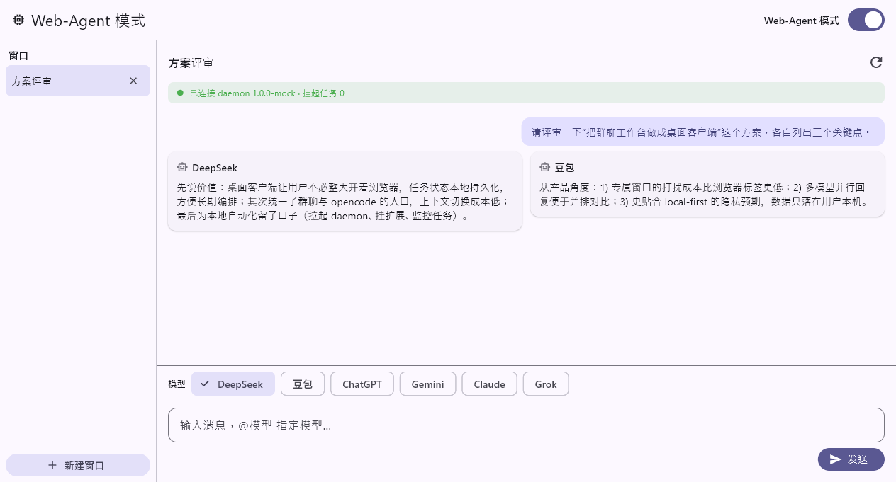

# Web Agent

**🌐 语言:** [English](README.md) | 简体中文

> 本地优先的 AI 专家团工作区：一个 Chrome 扩展，把你已登录的 DeepSeek / 豆包网页会话变成多人讨论的群聊工作台；配套本机智能体控制 CLI、OpenAI 兼容模型网关，以及 opencode 集成。



## 🌱 项目背景

Web Agent 是**基于 [openteam](https://github.com/afumu/openteam) 的二次开发项目**。它保留了 openteam 的核心思路——复用你浏览器里已登录的 AI 网页会话、不消耗任何模型 API token、在同一个群聊里组织多角色讨论——并在此之上扩展了：

- **本机智能体控制**：`web-agent` CLI + 本地 daemon（只监听 `127.0.0.1:19305`），让 Codex、Claude Code、opencode 等本机智能体可以创建群聊、添加角色、发布任务、等待回复。
- **模型网关**：daemon 同时提供 OpenAI 兼容端点（`/v1/models`、`/v1/chat/completions`），把请求转发给扩展里的 DeepSeek / 豆包网页会话；任何 OpenAI 兼容客户端（比如 opencode）都能把它们当模型用。
- **opencode 集成**：内置 `web-agent-control` skill 和 `ask_web` 插件（见[opencode 集成](#-opencode-集成可选)）。
- **桌面客户端**：可选的 Flutter Windows 客户端（`packages/web-agent-ui`）。

### 当前状态

| 站点 | 状态 |
| --- | --- |
| DeepSeek | ✅ 已完成初步开发并验证 |
| 豆包（Doubao） | ✅ 已完成初步开发并验证 |
| Gemini / ChatGPT / Claude / Grok | 继承自 openteam，**本项目尚未验证**，仅作保留 |

## 🧩 组成部分

| 组件 | 路径 | 说明 |
| --- | --- | --- |
| 浏览器扩展 | `public/`、`src/` | Manifest V3 Chrome 扩展：群聊工作台、站点适配器、人员库 |
| CLI + daemon + 网关 | `packages/web-agent/` | `web-agent` 命令、本地 daemon（`127.0.0.1:19305`）、`/v1` 模型网关 |
| opencode 集成 | `opencode.json`、`.opencode/` | skill 路径配置 + `ask_web` 插件 |
| 桌面客户端 | `packages/web-agent-ui/` | Flutter Windows 桌面客户端（可选） |

## 📥 前置准备（需要先下载什么）

| 软件 | 要求 | 用途 |
| --- | --- | --- |
| Node.js | ≥ 18 | 构建扩展、运行 CLI |
| Chrome / Chromium | 最新版 | 加载和使用扩展 |
| [opencode](https://opencode.ai) | `npm install -g opencode-ai` | 仅当使用 opencode 集成（skill / `ask_web` / 网关模型）时需要；只用浏览器扩展则不需要 |
| Flutter SDK | 任意较新版本 | 仅当要构建桌面客户端时需要 |

## 🚀 安装

### 1. 构建并加载浏览器扩展

```bash
git clone https://github.com/renjiahong25-cpu/personal_portfolio.git
cd personal_portfolio/web-agent
npm install
npm run build
```

打开 `chrome://extensions/`，开启**开发者模式**，点击**加载已解压的扩展程序**，选择生成的 `dist/` 目录。然后点击 Web Agent 扩展图标打开群聊工作台。

### 2. 安装 CLI 并启动本地 daemon

```bash
npm install -g ./packages/web-agent
# 或从 npm 安装：
# npm install -g @afumu/web-agent

web-agent daemon start
web-agent doctor
```

`daemon start` 是幂等命令，重复执行不会重复启动。如果 `doctor` 显示 `extension.connected: false`，请打开 Web Agent 扩展页面，在设置里开启**本机智能体控制**，再执行一次 `web-agent doctor`。

### 3. opencode 集成（可选）

仓库对 opencode 是开箱即用的：

- `opencode.json` 把 opencode 的 skill 搜索路径指向 `packages/web-agent/skills`，因此 opencode 在本目录运行时会自动发现 `web-agent-control` skill。
- `.opencode/plugins/ask-web.ts` 提供 `ask_web` 工具：调用本机模型网关（`http://127.0.0.1:19305/v1/chat/completions`），让 opencode 直接向 DeepSeek / 豆包网页会话提问。opencode 会自动加载 `.opencode/plugins/` 下的项目插件，并在启动时安装 `.opencode/package.json` 声明的依赖。

在 `web-agent` 目录里启动 opencode：

```bash
cd personal_portfolio/web-agent
opencode
```

之后用自然语言描述群聊任务即可：智能体会按 `web-agent-control` skill 的流程执行（启动 daemon → 建群 → 加角色 → 发任务 → 等回复），必要时还会用 `ask_web` 做单点提问。

**可选：把 DeepSeek / 豆包直接作为 opencode 的模型（经网关）。** 把下面配置合并进你的 opencode 配置（`~/.config/opencode/opencode.json`）：

```json
{
  "provider": {
    "web-agent": {
      "npm": "@ai-sdk/openai-compatible",
      "options": {
        "baseURL": "http://127.0.0.1:19305/v1",
        "setCacheKey": false,
        "apiKey": "<把本机 ~/.web-agent/control-token 文件的内容粘贴到这里>"
      },
      "models": {
        "deepseek": { "name": "DeepSeek (Web Agent)", "tools": true, "reasoning": true },
        "doubao":   { "name": "豆包 (Web Agent)", "tools": true, "reasoning": true }
      }
    }
  }
}
```

控制令牌由 daemon 首次启动时自动生成，保存在 `~/.web-agent/control-token`（Windows 为 `%USERPROFILE%\.web-agent\control-token`）。它是本机密钥——不要提交进任何仓库，也不要发到聊天里。

### 4. 桌面客户端（可选）

需要 Flutter SDK。在 `packages/web-agent-ui` 下构建并启动 Windows 客户端（见 [packages/web-agent-ui/README.md](packages/web-agent-ui/README.md)）。

## 🧭 工作原理

每个群聊成员绑定一个 AI 网页会话。发送消息时，扩展根据群聊模式、人设、引用消息和共享上下文构建 prompt，投递到对应成员的 iframe AI 页面，并监听网页回复。

```text
team.html
  -> background service worker
  -> AI site iframe
  -> content script
  -> AI webpage reply
  -> Web Agent message stream
```

本机控制回路走同一条链路，只是多了一个本地 HTTP 桥：

```text
本机智能体（CLI / opencode）
  -> web-agent daemon (127.0.0.1:19305)
  -> Chrome 扩展（本机智能体控制）
  -> AI site iframe
  -> 回复流式返回调用方
```

## ✨ 核心亮点

- 🚫 **0 API token 工作流**：复用 AI 网站网页会话，不直接调用模型 API。
- 🧩 **多模型讨论**：独立 / 协作两种模式，`@人员` 定向提问，`@所有人` 广播任务。
- 🧑‍🏫 **内置顾问库**：专家 / 思想风格模板一键起步，也支持自定义人员。
- 🤖 **智能体控制 CLI**：本机智能体建群、加角色、发任务、等回复。
- 🌉 **OpenAI 兼容网关**：把 DeepSeek / 豆包网页会话喂给任意 OpenAI 兼容客户端（含 opencode）。
- 💾 **本地优先存储**：群聊、人员、消息、笔记和设置都保存在浏览器本地存储。

## 🔐 权限、隐私与本机控制安全

扩展是本地优先的，但仍有值得了解的浏览器权限：`storage`、`tabs`、`alarms`、`declarativeNetRequest`（让支持的 AI 网站能嵌入 iframe 工作区）、`clipboardRead`/`clipboardWrite`，以及支持站点所需的 host 权限。

关于本机智能体控制：

- daemon **只监听 `127.0.0.1`**，不绑定公网地址。
- 所有 `/command` 与 `/v1` 请求必须携带 `Authorization: Bearer <控制令牌>`。
- 控制令牌由 daemon 首次启动时在本机生成，保存在 `~/.web-agent/control-token`；切勿提交进仓库或粘贴到聊天中。

Web Agent 不提供云端同步。你的 AI 对话仍然由你使用的 AI 网站处理，并受其账号规则、额度限制、隐私政策和服务条款约束。

## ⚠️ 风险提示

Web Agent 是非官方项目，仅供学习、研究和个人非商用用途。它不隶属于 OpenAI、Anthropic、Google、DeepSeek、字节跳动、xAI 或任何受支持的 AI 网站，也未获得这些平台背书或支持。

Web Agent 通过用户自己登录的浏览器网页会话和 DOM 自动化与 AI 网站交互。目标网站改版、账号规则、限流、反滥用机制或服务条款都可能影响它是否可用。使用者需要自行了解并遵守相关网站规则、政策、法律法规和服务条款。

请不要将 Web Agent 用于商业产品、托管服务、付费工作流、批量自动化、垃圾信息、爬取、绕过访问控制，或任何侵犯第三方条款与权利的行为。使用本项目产生的账号限制、服务中断、数据丢失、法律纠纷或其他后果，均由使用者自行承担。以上说明不构成法律建议。

## 🚧 当前限制

- 优先支持 Chrome / Chromium 系浏览器。
- 站点适配器依赖网页 DOM 结构，目标网站改版可能导致 prompt 发送或回复监听失效。
- 目前仅 DeepSeek 和豆包完成初步开发；其余适配器继承自 openteam，尚未验证。
- iframe 工作区依赖 `declarativeNetRequest` 调整响应头，权限面比普通 popup 扩展更重。
- 内置顾问模板是基于公开思想整理的提示词模板，不是真人参与，也不应被表述为真人参与。
- 医疗、法律、金融等高风险输出仍需用户自行判断，并咨询合格专业人士。

## 🛠️ 从源码开发

```bash
npm install
npm run dev
```

常用检查命令：

```bash
npm run typecheck
npm test
npm run build
npm run verify
```

`npm run verify` 会依次执行类型检查、单元测试和生产构建。

## 🗂️ 目录结构

```text
public/                 Chrome 扩展 manifest、团队页、样式、DNR 规则
src/background/         service worker、命令处理、运行时路由、控制客户端
src/content/            AI 站点 content scripts、适配器、回复监听
src/group/              群聊数据模型、存储、人员、prompt、@ 解析
src/teamPage/           Web Agent 工作台 UI
packages/web-agent/     本地 CLI、daemon、模型网关、智能体 skill
packages/web-agent-ui/  Flutter 桌面客户端（可选）
opencode.json           opencode skill 路径配置
.opencode/              opencode 项目插件（ask_web）
docs/                   设计文档和素材
```

## 🤝 参与贡献

欢迎提交 issue 和 pull request。比较适合作为起点的方向：DeepSeek / 豆包适配器修复、继承适配器的验证、权限与隐私加固、群聊路由 / prompt / 存储 / UI 的测试覆盖，以及文档完善。

提交 pull request 前，请运行 `npm run verify`。

## 📚 文档

- [设计文档](docs/DESIGN.zh-CN.md)
- [Web Agent CLI](packages/web-agent/README.zh-CN.md)
- [桌面客户端](packages/web-agent-ui/README.md)

## 📜 许可证

Web Agent 使用 [PolyForm Noncommercial License 1.0.0](LICENSE) 发布（SPDX: `PolyForm-Noncommercial-1.0.0`）。你可以在非商用目的下使用、学习、修改和再分发本项目。未经单独书面授权，禁止商用、商业再分发、托管商业服务、付费工作流或产品化商业使用。

本项目部分代码派生自 [openteam](https://github.com/afumu/openteam)，相应上游归属与许可条款对继承代码继续有效。
